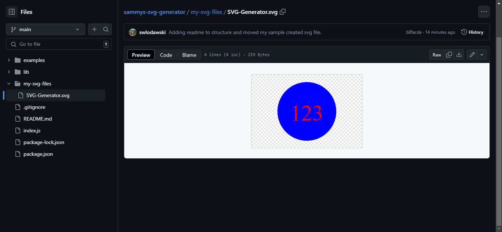

# sammys-svg-generator

# SVG Generator

I was asked to create a svg generator that would allow a user to be prompted with several questions to create a svg shape.

## Installation

In this application I used node, jest and inquirer packages as well as JavaScript.

To install the required package's run npm i in the terminal.

Screenshot of test svg file I created: 

## Usage
Upon interaction the user will be prompted with several question:
1. Enter a maximum of three alpha numeric characters.
2. Enter a color for the svg text.
3. Enter a choice of a shape with 3 choices offered.
4. Enter a color for the shape.
```

## Contributing
There were two contributors to this project with me being the primary one and one of my classmates providing advice:
1. Samuel Wlodawski
2. Andres Albornez

## License

I employed no license in the creation of this project.